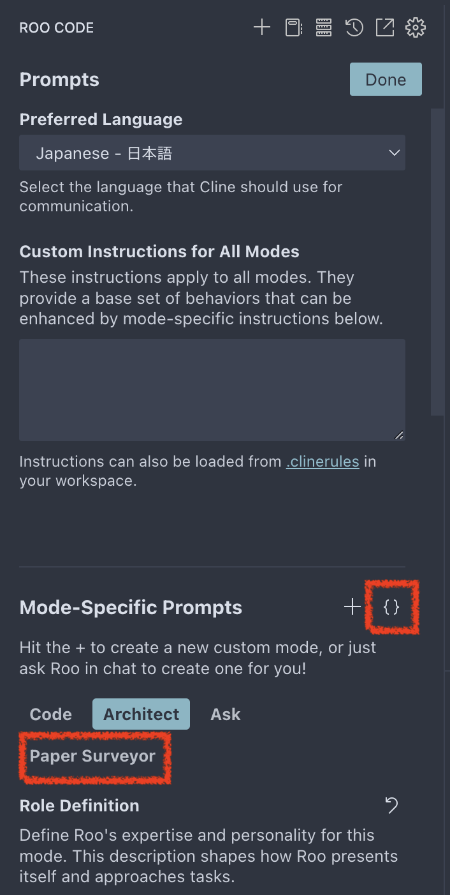

# AI Agent Surveyor

このリポジトリでは, `.clinerules-paper-survey` に基づいてRooが学術論文の要約およびサーベイを実行します.

- **論文要約**:
  - `incoming/` 内の論文ファイルおよび付随する bib ファイルを解析
  - スライド作成プロセスを実行し, 要約スライドを生成
- **トピック要約**:
  - 各論文の要約スライドから, トピック全体の研究動向や流れを整理

## Initial Setup

1. [Roo Code](https://marketplace.visualstudio.com/items?itemName=RooVeterinaryInc.roo-cline) をインストール
2. `cline_custom_modes.json` の内容を`Roo Code`のカスタムモードとして配置 (下記画像`{}`のマークから`cline_custom_modes.json`にコピー, Paper Surveyor モードができればOK)  
   
3. 依存パッケージのインストール:
   ([npm/pnpmなどがインストールされていない場合](https://pnpm.io/installation))
   ```sh
   pnpm install
   ```

## Usage

1. 論文ファイルを `incoming/` ディレクトリに保存

   - tex形式: `paper.tex`, `reference.bib`, `citation.bib`, `figure1.png`, `figure2.png`, ...
   - pdf形式: `paper.pdf`, `citation.bib`, `figure1.png`, `figure2.png`, ...

> [!NOTE]
> pdfの場合画像ファイル名は本文中の番号に対応している必要があります

> [!TIP]
> 一度に複数の論文をディレクトリを分けて保存しても大丈夫です

2. Rooに「サーベイ開始」または「start survey」とプロンプトを流します
3. 指示に従って, 論文ごとに `topics/` 内にディレクトリを作成し, 論文の要約スライドを作成します.
4. 終了したら `npm run dev --topic=[topic-name]` を実行し, 作成されたスライドを確認します

## ディレクトリ構造

```
.
├── incoming/              # 新規論文の一時保存ディレクトリ
│   ├── paper1             # 分析対象論文1 (ディレクトリ名は任意)
│   │   ├── paper.pdf/tex  # 分析対象論文ファイル
│   │   ├── reference.bib  # 論文の参考文献情報 (tex用)
│   │   └── citation.bib   # 論文の引用情報
│   └── paper2             # 分析対象論文2 (ディレクトリ名は任意)
│
├── topics/                # トピックごとのディレクトリ
│   ├── [topic-name]/      # トピック名のディレクトリ
│   │   ├── slides.md      # トピック全体のスライドソース (Slidev形式)
│   │   ├── [yyyy-author]  # 論文ID (発行年と著者名)
│   │   │   ├── paper.md   # 論文スライドソース (Slidev形式)
│   │   │   └── public/    # ビルドされたスライド
│   │   │       ├── fig1.png  # スライドに含める図
│   │   │       ├── fig2.png  # スライドに含める図
│   │   │       └── ...
│   │   └── ...
│   └── ...
└── README.md              # プロジェクト概要
```

## 動作確認

Claude-3.5-Sonnet (Anthropic/Github Copilot) で動作確認しました
ほかのLLMでの動作確認はしていません

## License

MITライセンスの下で公開されています.
またRoo Codeでのコマンド実行等を含みますので自動実行のリスクを考慮し自己責任でご利用ください.
